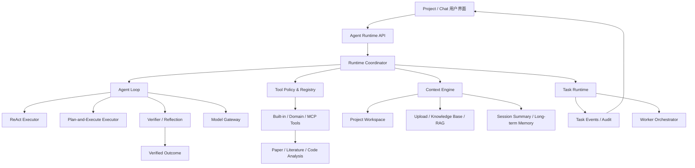

# 通用 Agent Runtime 设计

> 文档状态：当前长期架构基线 1.0
> 初版时间：2026-07-10
> 最近复核：2026-07-22（Project 双策略入口、LLM Router 与长期记忆已验收；当前排期以《科研 Project Agent 第一版实施计划》为准）
> 适用范围：通用 Agent、Project 科研工作区、普通对话、垂直科研能力接入
> 历史参考：《0708 后续计划及实施详情》（已归档）

## 1. 文档定位

本文档是后续通用 Agent 建设的主方向和共同约束，用于回答四个问题：

1. 我们最终要构建什么类型的 Agent。
2. Agent Runtime 的核心模块如何协作。
3. 最小 MVP 做什么、明确不做什么、怎样验收。
4. 当前代码如何以尽可能小的改动迁移到目标架构。

本文档同时包含长期架构、最小 MVP 和后续优化方向，但三者必须严格区分：

- **长期架构**定义稳定边界和运行时契约，不随单个需求频繁变化。
- **最小 MVP**定义第一阶段必须形成的端到端闭环，是当前实施承诺。
- **后续优化方向**是候选路线，不得反向扩大 MVP 范围。

旧文档继续保留为历史需求和原则清单，但不再按原十二阶段顺序推进。特别是旧文档将 Project 和工作区放在最后，这与当前产品目标不一致，本文档以新的优先级为准。

---

## 2. 产品定义

我们要构建的不是一个只会聊天和偶尔调用工具的通用助手，也不是一个可以任意控制整台电脑的开放式自动化 Agent。

目标产品是：

> **以用户授权的科研 Project 为核心工作空间，同时支持受限普通对话模式，能够理解代码、论文、科研报告、文献和实验材料，并通过规划、工具执行、验证与可审计修改帮助用户完成科研任务的通用 Agent。**

典型任务包括：

- 对照实验代码与论文方法章节，发现描述不一致并提出修改方案。
- 阅读一个 LaTeX 项目、BibTeX 文献库和科研报告，检查全文逻辑、公式说明、章节衔接和引用完整性。
- 根据用户目标制定多步骤计划，检索文献、补充证据、修改多个文件并输出变更报告。
- 分析代码、配置和实验结果，指出论文结论是否得到现有材料支持。
- 在普通对话中，基于用户上传文件、知识库和外部检索规划并执行受限任务。

### 2.1 两种能力配置

Project 模式与普通对话模式使用同一个 Runtime，不建设两套互不兼容的 Agent。

| 能力 | Project 模式 | 普通对话模式 |
|---|---|---|
| 当前会话 | 可用 | 可用 |
| 用户上传文件 | 可用 | 可用 |
| 用户知识库 | 可用 | 可用 |
| 用户授权的本地目录 | 可读，按策略可写 | 不可用 |
| Project 文件索引 | 可用 | 不可用 |
| 跨代码与论文分析 | 可用 | 仅限上传材料 |
| 文件修改 | 生成变更集，按风险确认 | 仅生成下载产物或建议 |
| 长任务 | 可用 | 可用 |
| 外部工具和文献检索 | 按策略开放 | 按策略开放 |

两种模式的差异由 `CapabilityProfile`、Project 授权和工具策略决定，不能只依靠提示词约束。

### 2.2 垂直能力的关系

论文润色、文献推荐、LaTeX 检查等是 Runtime 上层的领域能力，不应在通用 Agent 内重复实现业务细节。

- Runtime 负责任务状态、工具治理、上下文、执行循环、确认、验证、审计和评测。
- 论文能力负责论文结构分析、章节审查、改写、引用建议和领域质量规则。
- 文献能力负责真实检索、去重、分析、排序、推荐理由和 BibTeX 产物。
- Project Agent 可以调用这些领域能力，并将结果与本地项目材料组合起来。

### 2.3 本地文件访问的部署前提

“读取用户本地指定目录”必须区分部署形态，不能假设浏览器可以把任意本地路径直接交给远程后端。

- **本地部署**：Java 后端与用户文件位于同一台机器，后端可以在用户显式授权后直接访问 Project 根目录。这是 MVP 默认形态。
- **远程部署**：服务端无法直接访问用户电脑路径，必须增加受控的本地连接器或桌面 Agent，由连接器执行文件操作并返回结构化结果。
- **浏览器上传**：只适用于用户选择并上传的文件，不等价于持续访问本地 Project。

因此 Project 文件能力必须通过 `ProjectRootProvider` 抽象获得根目录。MVP 实现 `LOCAL_SERVER_ROOT`，未来再增加 `DESKTOP_CONNECTOR`，业务工具不能自行假设文件一定在服务端磁盘。

---

## 3. 目标、原则与非目标

### 3.1 核心目标

1. **真实执行**：能读取授权材料、调用真实工具、生成或修改真实产物，而不是只输出看起来合理的回答。
2. **受控自主**：允许模型规划和动态执行，但所有行为受权限、预算、状态机和成功条件约束。
3. **Project 理解**：能够建立代码、论文、文献、实验配置和报告之间的关系。
4. **可恢复**：长任务支持等待、取消、重试和恢复，前端断开不影响后台任务。
5. **可验证**：只有满足可观察成功条件后才能声明完成。
6. **可审计**：能够回答使用了哪些上下文、调用了哪些工具、修改了哪些文件以及为什么结束。
7. **可演进**：单 Agent、计划执行和未来 worker 共享同一套运行时契约。

### 3.2 设计原则

1. **Project 是权限边界，不只是文件集合。**
2. **模型提出意图，Runtime 决定能否执行。**
3. **只向模型暴露当前任务需要且允许的工具。**
4. **计划步骤必须有可观察的成功条件。**
5. **状态与结果分离。** `COMPLETED` 表示运行结束，`SUCCESS/PARTIAL/DEGRADED` 表示结果质量。
6. **确定性验证优先于模型反思。**
7. **语义工具优先于底层过程工具。** 异步轮询应由 Runtime 管理，避免把 start/status/result 全部交给模型。
8. **写入默认生成变更集。** 高风险变更必须确认，不允许模型无审计地覆盖重要资产。
9. **过程事件不暴露模型内部思维链。** 只展示计划、工具、状态、证据和可验证结果。
10. **先形成单 Agent 闭环，再扩大多 Agent 并发。**
11. **任何新能力必须同时定义失败行为、评测用例和回归范围。**

### 3.3 当前非目标

MVP 阶段明确不建设：

- 任意磁盘访问或操作系统级自动化。
- 完整容器沙箱和不受限制的代码执行。
- 自动编译所有 LaTeX 项目或自动复现实验。
- 无边界、无人监督的长期自主运行。
- 大规模自动多 Agent 调度。
- 支持所有二进制科研文件格式。
- 每个步骤都调用模型进行反思。
- 自动把所有会话内容写入长期记忆。
- 用 Runtime 替代论文润色和文献检索的领域流程。

---

## 4. 总体架构

Runtime 由七个核心子系统和一个领域能力层组成。



七个子系统分别是：

1. Agent Loop
2. 工具系统
3. 上下文系统
4. 任务能力
5. 多 Agent 编排
6. 可靠性与安全
7. 评测体系

### 4.1 Runtime Coordinator

`Runtime Coordinator` 是统一入口，负责：

1. 接收结构化任务请求。
2. 解析能力配置和 Project 授权。
3. 构建初始上下文。
4. 选择执行策略。
5. 驱动状态变化和事件记录。
6. 执行工具策略与人工确认。
7. 调用结果验证器。
8. 生成唯一最终回答和任务结果。

普通工具循环、Plan Agent 和未来 worker 不再各自拥有一套独立的任务语义。

### 4.2 核心请求对象

建议 Runtime 统一接收 `AgentRunRequest`：

```text
AgentRunRequest
  runId
  userId
  sessionId
  projectId?
  capabilityProfile: CHAT | PROJECT
  executionPolicy: ADVISE_ONLY | PROPOSE_CHANGES | APPLY_CONFIRMED
  objective
  attachments[]
  requestedSkill?
  permissions
  budgets
  clientRequestId
  parentRunId?
```

其中：

- `objective` 是用户当前目标，不是模型生成的计划。
- `projectId` 只在 Project 模式可用。
- `executionPolicy` 控制本次任务只分析、生成候选修改，还是允许确认后应用，不能由模型自行提升。
- `permissions` 来自服务端授权，不接受模型自行扩大。
- `budgets` 包含步骤、工具调用、时间、模型 token、并发等限制。
- `clientRequestId` 用于请求幂等。

### 4.3 Model Gateway

模型调用通过统一 `Model Gateway` 进入，不允许 Planner、Executor、Reflection 和领域服务各自猜测 provider、model 与 API key 的组合。

每次调用至少标记用途：

```text
MAIN
PLANNER
VERIFIER
SUMMARIZER
DOMAIN_PAPER
DOMAIN_LITERATURE
```

MVP 可以让多个用途复用同一个已验证的模型端点，但配置、日志和指标必须保留调用用途。模型解析遵守以下规则：

1. provider、model、base URL 和 credential 必须来自同一已验证配置来源。
2. 缺少当前 provider 的凭证时立即失败，不得静默借用其他 provider 的 key。
3. 模型名必须通过该 provider 的配置校验或显式用户配置，不使用未经验证的臆测默认值。
4. fallback 只能在策略中显式声明，并在事件和最终结果中标记。
5. 每次调用记录用途、模型来源、prompt 模板版本、token、耗时和 finish reason。

模型路由是横切能力，不增加第八套 Agent 子系统；它为 Agent Loop 和领域能力提供一致的调用与审计入口。

---

## 5. Agent Loop

### 5.1 执行范式不是三个独立 Agent

`ReAct`、`Plan-and-Execute` 和 `Reflection` 是同一 Runtime 的执行策略与阶段。

- **直接回答**：信息充分且不需要工具时使用。
- **ReAct**：目标较小但需要边观察边决定下一步时使用。
- **Plan-and-Execute**：跨文件、跨工具、可拆步骤的复杂任务使用。
- **Reflection**：关键产物或复杂任务验证阶段按需使用，不作为每轮默认步骤。

推荐组合：

```text
任务分类
  -> 必要时建立计划
  -> 每个步骤内部使用受预算约束的 ReAct
  -> 确定性验证
  -> 高价值任务按需 Reflection
  -> 修复、降级或结束
```

### 5.2 策略选择

策略选择分为“语义建议”和“运行约束”两层：LLM Router 理解任务结构并提出策略，Runtime 校验该策略在当前 capability、Project 授权、工具集合、沙箱确认和预算下是否可执行。Runtime 不应继续依赖关键词承担主要语义分类，也不能因为模型建议而扩大权限。

| 场景 | 推荐策略 |
|---|---|
| 常识解释、已有上下文总结 | DIRECT |
| Project 一次知识库搜索或单文件读取 | PLAN_EXECUTE |
| 目标不清，需要先探索 Project | PLAN_EXECUTE |
| 跨多个文件且有明确交付物 | PLAN_EXECUTE |
| 多个可并行且相互独立的子目标 | PLAN_EXECUTE，后续可拆 worker |
| 用户明确要求只分析、不修改 | DIRECT 或 READ_ONLY_PLAN |

不允许仅因为用户使用“计划”“分析”等词就机械进入 Plan 模式，也不能只按主观“任务难度”分类。Project Router 至少考虑是否需要工具、是否存在多个依赖目标、材料范围和交付成功条件。当前 Project 顶层输出是结构化的 `DIRECT / PLAN_EXECUTE` 建议及简短理由；普通非 Project Chat 保留既有 ReAct，Project 步骤内 ReAct 延后到阶段 11。Runtime 对不可执行建议进行明确降级或失败。

执行策略与修改权限相互独立。例如 `PLAN_EXECUTE + ADVISE_ONLY` 可以完成复杂跨文件审查，但不能写文件；`PLAN_EXECUTE + PROPOSE_CHANGES` 可以生成受治理 Candidate，但不能直接应用。

### 5.3 生命周期状态与结果分离

统一任务生命周期建议保留以下状态：

```text
PENDING
RUNNING
WAITING_INPUT
PAUSED
CANCEL_REQUESTED
CANCELLING
COMPLETED
FAILED
CANCELLED
```

`RUNNING` 内部通过 `phase` 表达当前阶段：

```text
ROUTING
CONTEXT_PREPARING
PLANNING
EXECUTING
WAITING_TOOL
VERIFYING
FINALIZING
```

终态之外单独记录 `outcome`：

```text
SUCCESS
PARTIAL
DEGRADED
FAILURE
```

这样可以避免把 `PARTIAL`、`DEGRADED` 同时当作任务状态和步骤状态造成混乱。

### 5.4 核心循环

```text
1. 校验请求、权限和幂等键
2. 构建 ContextPackage
3. 为 Project 选择 DIRECT / PLAN_EXECUTE；普通 Chat 可保留 REACT
4. 创建预算和终止条件
5. 请求模型生成下一动作
6. 校验动作是否允许
7. 执行动作或进入 WAITING_INPUT / WAITING_TOOL
8. 记录结构化观察结果
9. 判断步骤成功条件和全局目标是否满足
10. 未满足且预算允许时继续
11. 执行最终验证
12. 生成唯一最终回答并记录 outcome
```

### 5.5 终止条件

满足任一条件时 Runtime 必须停止继续调用模型或工具：

- 所有必需成功条件已验证。
- 需要用户确认或缺少必要信息。
- 工具返回不可恢复错误。
- 步骤、工具、时间或 token 预算耗尽。
- 检测到无进展循环。
- 用户取消任务。
- Project 文件发生外部修改，当前变更集已失效。
- Runtime 无法证明继续执行会提高完成度。

预算耗尽不能自动等价为成功。此时应根据已有产物标记 `PARTIAL` 或 `FAILURE`。

### 5.6 无进展检测

无进展不能只用“相同工具名和相同参数”判断。Runtime 应组合以下信号：

- 调用签名是否重复。
- 工具是否声明允许轮询。
- 观察结果版本或状态是否变化。
- 是否新增证据、产物或已完成成功条件。
- 当前步骤剩余预算。

`poll` 类调用可重复，但必须遵守最小间隔、最大次数和任务终态；普通查询或写入工具默认禁止同签名重复。

---

## 6. 工具系统

### 6.1 工具注册与元数据

工具定义需要从“名称、描述、参数”升级为可由 Runtime 执行的治理契约。

建议每个工具包含：

```text
ToolDescriptor
  name
  version
  capability
  description
  inputSchema
  outputSchema
  supportedProfiles[]
  requiredPermissions[]
  riskLevel
  sideEffectType
  confirmationPolicy
  asyncMode
  idempotencyPolicy
  repeatPolicy
  timeoutPolicy
  retryPolicy
  concurrencyPolicy
  successPredicate
  fallbackPolicy
  auditPolicy
```

关键枚举建议：

```text
riskLevel: LOW | MEDIUM | HIGH | CRITICAL
sideEffectType: NONE | CREATE | MODIFY | DELETE | EXECUTE | EXTERNAL_SEND
confirmationPolicy: NEVER | ON_SIDE_EFFECT | ON_HIGH_RISK | ALWAYS
asyncMode: SYNC | RUNTIME_MANAGED_ASYNC | EXTERNAL_TASK
repeatPolicy: DENY_SAME_INPUT | ALLOW_LIMITED | POLL_UNTIL_TERMINAL
idempotencyPolicy: NONE | OPTIONAL_KEY | REQUIRED_KEY
```

完整 ToolDescriptor 是长期契约。MVP 首先落地以下最小字段：

```text
supportedProfiles
requiredPermissions
sideEffectType
confirmationPolicy
asyncMode
idempotencyPolicy
repeatPolicy
timeoutPolicy
retryPolicy.retryableErrorCodes
successPredicate
```

成本估计、工具健康评分和复杂并发策略可以在 MVP 后补充，不能为了元数据完整而阻塞核心闭环。

### 6.2 动态暴露流程

工具不能全部交给模型。每轮工具集合按以下顺序求交集：

```text
已注册工具
∩ 当前能力配置允许的工具
∩ 用户和 Project 权限允许的工具
∩ 当前 Skill 允许的工具
∩ 当前计划步骤声明的工具
∩ 当前风险状态允许的工具
```

模型看到的工具应保持语义清晰、数量有限。底层管理工具、内部迁移工具、状态镜像工具默认不可见。

工具集合必须 fail-closed，并统一以下语义：

```text
null = 继承上游已经计算完成的允许集合
[]   = 明确禁止全部工具
```

任何求交结果为空都不得转换为 `null` 或“允许全部”。普通 ReAct 和 Plan 步骤必须经过同一策略入口，工具执行器在真正调用前还要根据 `runId`、步骤和权限快照再次鉴权，不能只相信模型收到的工具列表。

`null=继承` 只允许出现在策略合并的中间层。进入模型请求和工具执行器前必须生成不可为空的 `ResolvedToolPolicy`；其 `allowedTools=[]` 时就是拒绝全部，执行器接口不再接受 `null` 工具策略。

### 6.3 语义工具与异步工具

对模型优先暴露一个表达业务目标的语义工具。例如文献推荐只暴露 `recommend_literature`，而不是同时暴露：

```text
literature_search_start
literature_search_status
literature_search_result
```

如果语义工具内部是异步任务，Runtime 负责：

1. 启动后台任务。
2. 保存 `taskHandle` 和幂等键。
3. 按建议间隔轮询或订阅事件。
4. 在前端展示进度。
5. 终态后把结构化结果交回 Agent Loop。

模型不需要消耗多轮推理来维持心跳，也不会因重复调用策略误杀合法轮询。

统一异步返回结构建议为：

```text
AsyncToolResult
  taskHandle
  state: ACCEPTED | RUNNING | WAITING_INPUT | COMPLETED | FAILED | CANCELLED
  progress?
  nextPollAfterMs?
  resultRef?
  error?
```

### 6.4 错误恢复

工具失败必须被分类，不能只返回字符串异常：

```text
VALIDATION_ERROR
PERMISSION_DENIED
NOT_FOUND
CONFLICT
RATE_LIMITED
TIMEOUT
TRANSIENT_EXTERNAL_ERROR
PERMANENT_EXTERNAL_ERROR
INTERNAL_ERROR
CANCELLED
```

只有显式声明可重试的错误才能自动重试。写入工具必须同时满足幂等要求，才能在超时后自动重试。

### 6.5 工具结果

工具结果至少包含：

```text
success
data
errorCode?
errorMessage?
retryable
evidenceRefs[]
artifactRefs[]
sideEffects[]
version
```

模型生成的自然语言不能覆盖工具的结构化失败状态。

MVP 必须增加统一 `GovernedToolExecutor`，同时适配注册式工具和 LangChain4j 注解工具。注解工具返回的 JSON 字符串需要先解析为 typed `ToolResult`，识别真实的 `success/errorCode/retryable`，再记录事件并交给模型。仅仅“方法没有抛异常”不能视为工具成功。

---

## 7. Project 工作区与上下文系统

### 7.1 Project 是第一类实体

Project 至少包含：

```text
Project
  projectId
  userId
  name
  rootPath
  canonicalRootPath
  accessMode: READ_ONLY | READ_WRITE
  includeRules[]
  ignoreRules[]
  createdAt
  lastIndexedAt
  indexVersion
```

用户必须显式选择并授权目录。Runtime 只接收 `projectId`，模型不能直接指定或扩大真实根路径。

Project 记录只保存经过授权流程确认的根目录。工具运行时通过 `ProjectRootProvider` 获取有效根目录和访问凭据，不能从模型参数直接构造绝对路径。

### 7.2 路径安全

所有文件工具必须满足：

1. 只接受 Project 相对路径。
2. 使用规范化后的真实路径检查根目录边界。
3. 防止 `..`、符号链接、Windows junction 和大小写差异越界。
4. 默认忽略 `.git`、构建缓存、依赖目录、大型二进制文件和密钥文件。
5. `.env`、私钥、访问令牌等敏感文件默认禁止读取和索引。
6. 文件写入必须记录修改前 hash、修改后 hash 和任务 ID。

当前把服务进程工作目录作为 `workspaceRoot` 的实现只能作为临时能力，不能视为 Project 授权模型。

### 7.3 文件清单与解析

MVP 优先支持：

- 代码和配置：Java、Python、JavaScript/TypeScript、JSON、YAML、XML、properties。
- 科研文本：LaTeX、BibTeX、Markdown、纯文本。
- 用户上传材料：沿用现有知识库解析能力。

每个文件记录：

```text
path
type
size
contentHash
modifiedAt
language
parseStatus
symbolOrSectionSummary
indexVersion
```

大文件不能整文件送入模型。需要基于代码符号、LaTeX 章节、BibTeX 条目和文本段落进行结构化切分。

### 7.4 ContextPackage

所有执行策略使用统一上下文包：

```text
ContextPackage
  runtimeIdentity
  objective
  capabilityProfile
  permissions
  recentConversation
  sessionSummary
  taskState
  planState?
  projectManifest?
  retrievedProjectChunks[]
  uploadedDocumentChunks[]
  knowledgeBaseChunks[]
  longTermMemories[]
  artifacts[]
  evidenceLedger[]
  tokenBudget
  provenance
```

每个上下文片段必须记录来源、版本和选择原因。Project 文件中的文字视为不可信数据，不能覆盖系统指令和权限策略。

只有 Runtime 自有策略、身份和安全约束可以使用 system role。Project 文件、RAG 片段、网页内容和普通工具文本必须作为带明确来源边界的 data/tool 内容注入，不能因为“需要提醒模型”而升级成 system message。

### 7.5 上下文选择顺序

建议按以下优先级分配预算：

1. 当前用户目标和明确约束。
2. 当前任务、计划和等待状态。
3. 当前步骤必需的 Project 文件片段。
4. 直接相关的上传文件和知识库证据。
5. 最近会话窗口。
6. 会话摘要。
7. 已确认且始终适用的全局用户偏好。
8. 有来源且与当前任务高相关的其他长期记忆。
9. 补充背景材料。

不能因为已有会话很长，就挤掉当前任务必需的文件和成功条件。

### 7.6 短期记忆与会话压缩

短期记忆包括最近消息、会话摘要和当前任务状态。

- 摘要必须区分用户事实、用户偏好、已完成任务和未决事项。
- 工具原始大结果不直接进入长期会话窗口，只保留结构化摘要和结果引用。
- 会话压缩后必须保留用户约束、确认决定、Project ID 和未完成任务。

### 7.7 长期记忆

长期记忆只读接入经过确认的内容，不自动记住全部会话。当前普通 Chat 已接入受治理长期记忆，但 Plan 的 Planner、步骤与最终总结尚未完整复用同一上下文，这是下一阶段必须消除的不一致。

长期记忆条目需要：

```text
memoryId
userId
type
content
source
confidence
createdAt
lastUsedAt
expiresAt?
```

长期记忆分为两类：

- **全局用户偏好**：例如默认回答语言和固定格式。用户确认后每次请求始终注入，不经过语义相似度门槛。
- **任务相关记忆**：Project 事实、研究决策、术语和经验。继续按用户、Project、版本、来源与相关性检索。

DIRECT、REACT、Planner、Plan 步骤和最终总结必须消费同一受信 ContextPackage。任何策略不得另建一条绕过记忆治理的提示链，也不得把未经确认的模型猜测自动写入长期记忆。

### 7.8 任务工作区和证据账本

每个任务维护独立工作区逻辑视图：

- 输入文件与版本。
- 生成的计划。
- 中间分析结果。
- 工具结果引用。
- 候选变更集。
- 用户确认记录。
- 最终产物。
- 证据账本。

证据账本用于把结论映射到来源：

```text
claim -> file/chunk/tool result -> version -> verification state
```

它是防止虚假完成和无来源论文建议的基础。

### 7.9 文件修改协议

MVP 不允许模型直接无条件覆盖用户文件。推荐流程：

```text
读取文件及 contentHash
  -> 生成 ChangeSet / patch
  -> 校验目标仍是原版本
  -> 按风险请求确认
  -> 原子应用
  -> 重新读取并验证
  -> 记录审计事件
```

`ChangeSet` 至少包含：

```text
changeSetId
baseSnapshot
affectedFiles[]
diffs[]
reason
riskLevel
requiresConfirmation
status
```

如果用户在 Agent 执行期间修改了文件，hash 不一致时必须停止应用并报告冲突，不能覆盖用户的新内容。

---

## 8. 任务能力

### 8.1 统一任务模型

对话工具任务、计划任务、文献任务和论文任务应逐步映射到统一任务模型：

```text
AgentTask
  taskId
  runId
  userId
  sessionId
  projectId?
  taskType
  status
  phase
  outcome?
  progress?
  currentStepId?
  parentTaskId?
  idempotencyKey
  deadlineAt?
  createdAt
  updatedAt
```

领域任务可以保留自己的详细表，但必须由统一任务记录对外表达状态，避免前端同时猜测多套状态。

迁移期不能提前宣称 `AgentTask` 已经是所有任务的单一事实来源。统一规则是：

- 接入前，领域表或 Plan/Turn 表是生命周期事实来源，`AgentTask` 只是 legacy adapter 或只读投影。
- 接入时，必须为源状态显式定义到 `status/phase/outcome` 的映射，禁止根据字符串相似度猜测。
- 接入完成后，`AgentTask` 成为通用生命周期的唯一写入源，领域表只保存领域阶段和产物细节。
- 禁止两个事实来源双向更新同一个状态。

Plan 的目标映射至少包括：`REVIEWING -> PENDING/PLANNING`、`RUNNING -> RUNNING/EXECUTING`、`PAUSED -> PAUSED`、`FAILED -> FAILED/FAILURE`、`CANCELLED -> CANCELLED`。`COMPLETED` 的 outcome 必须根据步骤验证结果确定，不能一律映射成 `SUCCESS`。

### 8.2 计划和步骤

计划步骤至少包含：

```text
stepId
title
objective
dependencies[]
allowedTools[]
requiredInputs[]
expectedOutputs[]
successCriteria[]
riskLevel
status
attempt
budget
owner
```

计划不是展示用文本，而是 Runtime 的执行数据。步骤完成前必须验证 `successCriteria`。

成功条件不能只保存任意自由文本。每条条件至少绑定一个 verifier：

```text
SuccessCriterion
  criterionId
  type: FILE_VERSION | TOOL_RESULT | ARTIFACT | EVIDENCE | DOMAIN_RULE | MODEL_JUDGE
  parameters
  required
```

自然语言可以作为说明，但不能成为 Runtime 唯一可执行的完成依据。

### 8.3 暂停、恢复、重试与取消

- **暂停**：停止调度新动作，保存当前上下文和可恢复点。
- **恢复**：从持久化状态重新构建 ContextPackage，不能依赖内存中的模型对象。
- **重试**：只重试失败步骤或可证明幂等的动作。
- **取消**：依次进入 `CANCEL_REQUESTED -> CANCELLING -> CANCELLED`。后台执行器在模型调用前后、工具调用前后和写入提交前检查取消令牌；只有 worker 已停止或全部副作用已登记后才能进入终态。
- **前端断开**：只断开事件订阅，不改变后台任务状态。

任务持久性分三级，验收时必须说明当前达到哪一级：

```text
L0 REQUEST_BOUND      请求结束或连接断开后任务不保证继续
L1 PROCESS_DURABLE    前端断开后继续，但服务进程重启后不保证恢复
L2 RESTART_RESUMABLE  使用持久化队列、claim lease、心跳、超时回收和重启认领
```

现有进程内线程池最多属于 L1，不能称为可重启恢复。MVP 只承诺只读 Project 任务达到 L1；L2 放入后续任务基础设施阶段。

### 8.4 人工确认

确认是任务状态，不是普通聊天问句。确认请求应结构化记录：

```text
ConfirmationRequest
  confirmationId
  taskId
  actionType
  summary
  affectedResources[]
  diffRef?
  riskLevel
  expiresAt?
```

等待确认时任务进入 `WAITING_INPUT`。恢复后必须验证确认对应的动作和资源版本仍然有效。

### 8.5 并发

MVP 默认串行执行计划步骤和工具调用。完成工具副作用元数据、资源范围和取消安全点后，才允许以下有限并发：

- 只读、无依赖、资源不重叠的计划步骤可以并行。
- 同一文件的读取可以并行，写入必须串行。
- 同一数据库实体的写操作必须使用版本或幂等键。
- 并发模型分析不能长时间持有数据库事务或文件锁。

仅有 DAG 依赖不代表步骤可以安全并发。调度器必须同时证明 `sideEffectType=NONE`，并且声明的资源范围不冲突；所有文件写入统一串行。

前端进度必须来自任务事件和已完成成功条件，不能根据页面计时猜测阶段。

### 8.6 任务事件

事件示例：

```text
task_created
phase_changed
plan_created
step_started
tool_started
tool_progress
tool_completed
artifact_created
change_set_ready
confirmation_requested
verification_completed
step_completed
task_completed
task_failed
task_cancelled
```

事件负载只包含可观察事实，不保存或展示模型内部思维链。

---

## 9. 多 Agent 编排

### 9.1 定位

多 Agent 是 Task Runtime 之上的编排能力，不是另一套 Runtime。每个 worker 继续使用相同的工具权限、上下文格式、预算、状态、事件和验证协议。

### 9.2 拆 worker 的条件

仅在同时满足以下条件时考虑拆分：

- 子任务边界清楚。
- 输入和预期输出可结构化描述。
- 子任务可以独立验证。
- 资源写入范围可以隔离。
- 并行收益明显高于协调成本。

不应拆分：

- 普通问答。
- 单工具任务。
- 依赖关系强的连续改写。
- 多个 worker 必须频繁修改同一文件的任务。

### 9.3 WorkerTaskPacket

```text
WorkerTaskPacket
  workerTaskId
  parentTaskId
  objective
  contextRefs[]
  allowedTools[]
  readScopes[]
  writeScopes[]
  ownedResources[]
  successCriteria[]
  outputSchema
  budget
  deadline
```

不能把整个主会话和整个 Project 无差别复制给 worker。

### 9.4 结果共享与汇总

worker 返回：

```text
WorkerResult
  status
  outcome
  summary
  evidenceRefs[]
  artifactRefs[]
  proposedChanges[]
  unresolvedIssues[]
```

worker 只能声明自己的子任务完成。父 Agent 负责检查整体成功条件、解决冲突并生成唯一最终回答。

### 9.5 写冲突控制

- MVP 后续首先采用单写者原则。
- worker 默认只读，修改通过候选 ChangeSet 返回父 Agent。
- 必须并行写入时，使用文件资源租约和基线 hash。
- 同一文件不能同时由两个 worker 持有写权限。
- 用户修改始终优先，检测到外部变化后 worker 变更必须重新基线化。

### 9.6 MVP 中的多 Agent 边界

本文档定义 worker 协议，但最小 MVP 不实现多 Agent 调度。MVP 通过后可以先验证一个受控只读场景，例如：

- worker A 分析代码实现。
- worker B 分析论文方法章节。
- 父 Agent 对照两者并形成差异报告。

后续首个多 Agent 验证也不允许模型自由创建任意数量 worker，更不允许多个 worker 直接并发写用户文件。

---

## 10. 可靠性与安全

### 10.1 防止乱选工具

- 工具动态暴露，而不是只在提示词中要求谨慎。
- 计划步骤声明 `allowedTools`。
- 写入、删除、执行和外发工具按权限单独控制。
- 工具选择评测必须覆盖相近工具之间的混淆。
- 领域能力只保留一个面向模型的主要入口，内部过程工具隐藏。

### 10.2 防止死循环和重复调用

- 每个 run、计划和步骤都有独立预算。
- 重复策略由工具元数据决定。
- 异步轮询由 Runtime 托管。
- 连续观察无变化时触发无进展检测。
- 达到预算后只能进入验证、降级或失败，不能继续秘密调用。

### 10.3 防止虚假完成

模型的“已经完成”只是候选结论。Runtime 至少检查：

- 必需产物是否存在。
- 文件修改是否实际应用。
- 工具是否结构化返回成功。
- 计划必需步骤是否通过验证。
- 引用、证据和文件版本是否可追溯。
- 用户要求的输出格式是否满足。
- 是否仍有阻塞项或未确认操作。

未通过验证时，不允许 `outcome=SUCCESS`。

### 10.4 Verifier 与 Reflection

验证分三层：

1. **结构验证**：schema、文件存在、hash、状态、引用键等确定性检查。
2. **规则验证**：LaTeX 结构、代码静态检查、章节覆盖、证据完整性等领域规则。
3. **模型审查**：全文逻辑、代码与论文语义一致性、复杂建议完整性。

模型 Reflection 仅用于第三层或计划修复，不替代前两层。

MVP 中 Reflection 默认只在复杂 Project 任务的最终验证阶段调用一次；只有发现明确且可修复的问题时，才允许进入一次受预算约束的修复循环。超过预算后应返回 `PARTIAL` 或 `FAILURE`，不能形成“反思再反思”的新循环。

### 10.5 Prompt Injection 与不可信内容

Project 文件、网页、论文和知识库内容全部视为不可信输入：

- 文件中的指令不得改变系统权限。
- 检索内容不得要求调用未授权工具。
- 工具输出中的自然语言不得直接升级权限。
- 涉及外发数据时必须检查来源和用户授权。
- 敏感文件默认不进入索引和模型上下文。

### 10.6 审计

每个 run 至少记录：

- 用户目标和能力配置。
- 使用的模型来源和版本。
- 上下文来源摘要及版本。
- 实际暴露的工具集合和原因。
- 工具调用、结果状态、耗时和重试。
- 状态变化和确认决定。
- 文件变更集和版本冲突。
- 验证结果和最终 outcome。

审计日志不得记录密钥、完整敏感文件和模型隐藏思维链。

### 10.7 失败分类

任务失败至少区分：

```text
INVALID_REQUEST
INSUFFICIENT_CONTEXT
PERMISSION_DENIED
WAITING_USER_EXPIRED
TOOL_FAILURE
MODEL_FAILURE
BUDGET_EXCEEDED
NO_PROGRESS
VERSION_CONFLICT
VERIFICATION_FAILED
CANCELLED_BY_USER
INTERNAL_ERROR
```

失败分类决定是否允许重试、是否需要用户输入以及前端如何展示。

---

## 11. 评测体系

### 11.1 评测目标

评测必须判断 Agent 是否真实完成任务，而不是只判断回答是否流畅。

评测分为：

1. **组件测试**：状态机、工具策略、路径边界、幂等、上下文裁剪。
2. **轨迹测试**：工具选择、步骤数量、重复调用、确认和终止行为。
3. **任务结果测试**：产物、变更、引用和成功条件。
4. **真实科研场景评测**：代码、论文、报告和文献的组合任务。
5. **回归评测**：每次 Runtime、模型或工具变更后重复执行固定集合。

### 11.2 核心指标

| 指标 | 定义 |
|---|---|
| Task Success Rate | 所有必需成功条件通过的任务比例 |
| False Completion Rate | 声明成功但验证失败的比例 |
| Tool Selection Accuracy | 需要工具时选择正确语义工具的比例 |
| Unnecessary Tool Rate | 不需要工具却调用，或调用无关工具的比例 |
| Duplicate Call Rate | 非策略允许的重复调用比例 |
| Recovery Success Rate | 可恢复失败最终完成的比例 |
| Confirmation Compliance | 高风险操作正确等待确认的比例 |
| Evidence Coverage | 关键结论具有可追溯证据的比例 |
| Unauthorized Access Rate | 越界读取、写入或外发比例 |
| Cost and Latency | 每类任务的 token、工具次数和总耗时 |

### 11.3 MVP 评测集

最小 MVP 先建立 8 至 12 个小而稳定的任务，至少覆盖：

- 2 个 Project 文件查找与只读分析任务。
- 3 个代码、论文或报告的交叉验证任务。
- 1 个基于审查结果生成候选 patch 产物但不应用的任务。
- 2 个权限、路径越界、符号链接或提示注入任务。
- 2 个工具失败、预算耗尽或虚假完成任务。
- 1 个前端断开、取消或 L1 后台继续任务。

每个用例必须包含：

```text
输入材料
能力配置
允许工具
禁止动作
成功条件
预期产物
可接受降级
最大预算
判分脚本或人工评分表
固定模型配置与 prompt 版本
执行重复次数
```

安全项使用确定性测试，不通过模型概率评分。涉及模型决策的任务固定 provider、model、参数、prompt 版本和工具版本，每个用例至少重复运行 3 次，分别记录单次结果和稳定通过率。

### 11.4 MVP 发布门槛

第一阶段建议使用以下硬门槛：

- 路径越界和未授权写入阻断率：100%。
- MVP 本地写工具不可见且不可执行：100%。
- 关键安全用例虚假完成数：0。
- 非法重复调用和无限循环数：0。
- 每个 Project 只读场景类别成功率：不低于 80%，不得只看总体平均值。
- 工具选择准确率：不低于 90%，并报告每个工具的混淆情况。
- 所有失败任务具有明确错误分类和审计事件。
- 声明为 L1 的任务在前端断开后继续运行，但不宣称服务重启后可恢复。

阈值可在首轮基线测试后调整，但降低安全类门槛必须形成显式设计决策。

---

## 12. 最小 MVP 方案

### 12.1 MVP 目标

用最少的新机制验证以下核心闭环：

> **用户授权一个只读科研 Project，Agent 在 fail-closed 的工具权限和预算内读取相关文件，使用 ReAct 或受控计划完成跨代码、论文和报告的审查，输出带文件版本与证据的结论，并可生成候选 patch 产物，但不直接应用到用户文件。**

安全应用修改是紧随 MVP 的第一个扩展，不与只读闭环同时开发。这样仍能验证科研 Project 理解、Plan-and-Execute、ReAct、按需 Reflection、工具治理和真实完成判断，同时避免在 ChangeSet 安全链完成前开放危险写入。

MVP 假设后端以本地部署方式运行并能够访问用户授权目录。远程部署所需的桌面连接器只保留接口边界，不在本阶段实现。

### 12.2 MVP 必须包含

#### A. Project 基础

- 创建 Project 并选择本地根目录。
- MVP 只开放 `READ_ONLY`；数据结构可以保留 `READ_WRITE`，但服务端拒绝启用。
- 规范路径校验、敏感文件忽略、文件类型白名单。
- 文件清单、hash 和基础结构化索引。
- Project 相对路径读取和搜索。

#### B. 统一 Agent Loop

- Project 审查支持 REACT 和受控 PLAN_EXECUTE，现有 CHAT/DIRECT 行为保持兼容。
- 计划步骤内部复用受预算约束的 ReAct。
- 统一状态、phase、outcome 和终止条件。
- 每轮只产生一个最终回答。

#### C. 工具治理

- 在现有 ToolRegistry 上增加最小治理元数据。
- 按 CHAT/PROJECT、Skill、步骤和权限动态暴露工具。
- Plan 和 ReAct 使用同一 fail-closed 工具策略，并在执行器层再次鉴权。
- 通过 GovernedToolExecutor 统一真实成功、错误分类、超时和重复策略。
- MVP Project 工具仅包含只读搜索、读取和结构检查；写工具硬禁用。

#### D. 上下文

- 在现有 ContextPackage 上增加 Project manifest 和检索片段，不要求本阶段重写所有 CHAT 上下文。
- Project 文件来源、版本和引用可追溯。
- Project/RAG/工具内容作为不可信 data/tool 内容，不能获得 system 优先级。
- 长期记忆治理与普通 Chat 只读接入已完成；统一入口阶段必须让 Planner、Plan 步骤和最终总结复用相同的全局偏好与受治理相关记忆。

#### E. 任务与变更

- Project 审查任务持久化状态、步骤、证据引用和事件。
- MVP 默认串行执行，支持安全点取消。
- L1 任务在前端断开后继续，明确不承诺服务重启恢复。
- 候选修改只生成 patch 或 ChangeSet 产物，不应用用户文件。

#### F. 验证与评测

- typed ToolResult、文件版本、证据覆盖和计划成功条件验证。
- 至少一项领域规则验证，例如 LaTeX 引用键或章节完整性。
- 完成 MVP 固定评测集和发布报告。

### 12.3 MVP 不包含

- 任何 Project 本地文件写入、追加、删除或重命名。
- ChangeSet 自动应用和 `READ_WRITE` 模式。
- 通用异步工具托管和服务重启后的任务恢复。
- 普通 CHAT 与所有领域任务的完整状态迁移。
- 完整沙箱和代码执行。
- 自动编译论文。
- 自动运行实验。
- 自由多 Agent 编排。
- 多 worker 并发写文件。
- 全格式文档解析。
- 自动长期记忆写入。
- 大规模 Project 全量向量化。
- 将论文润色流程重写进通用 Runtime。

### 12.4 MVP 代表性用户流程

#### 流程一：Project 只读审查

用户请求：

> 检查论文方法章节与代码实现是否一致，只分析，不修改。

预期：

1. Runtime 识别为 Project 只读复杂任务。
2. 建立计划并定位相关 `.tex`、代码和配置文件。
3. 读取必要片段并记录版本。
4. 形成差异结论，每项关联文件和行段证据。
5. Verifier 检查证据覆盖后结束。

#### 流程二：生成候选修改

用户请求：

> 根据代码实际参数修改论文方法和实验设置章节。

预期：

1. Agent 读取代码、配置与论文。
2. 生成跨文件修改计划。
3. 生成带基线 hash 的候选 patch 或 ChangeSet 产物。
4. Runtime 拒绝直接调用本地写工具。
5. 输出建议修改的文件、原因、证据和未解决问题，不声称已经修改用户文件。

#### 流程三：普通对话受限执行

用户上传论文与报告，但没有 Project 授权。

预期：

1. Runtime 使用 CHAT 能力配置。
2. Agent 可读取上传文件、知识库和调用文献工具。
3. 本地文件工具完全不暴露。
4. 输出建议或可下载产物，不声称已修改用户本地文件。

流程三用于验证能力隔离和现有 CHAT 兼容，不要求 MVP 内完成普通对话执行链的整体重构。

### 12.5 实施切片

#### MVP-0：基线和契约

- 固化当前关键行为测试。
- 固化 `null` 与空工具集合语义并增加 fail-closed 测试。
- 建立 Project 审查任务所需的最小 status、phase、outcome、错误和事件字段。
- 记录现有 ReAct、Plan、Task adapter 和上下文注入的真实行为。

验收：现有对话、计划、论文和文献链路不因数据结构调整而回归。

#### MVP-1：Project 权限边界

- 新增只读 Project 根目录授权。
- 将文件工具从进程工作目录改为按请求解析 Project。
- 增加真实路径、符号链接/junction 越界、敏感文件和版本 hash 测试。
- 在 CHAT 和 Project MVP 中硬禁用本地写工具。

验收：CHAT 模式不能使用本地文件工具；PROJECT 模式无法越过授权根目录。

#### MVP-2：统一执行入口

- 引入 Runtime Coordinator。
- 让 Project REACT 和 PLAN_EXECUTE 共享工具策略、预算、状态、事件和最终结果。
- 保留现有 API 作为适配层，避免一次性重写前端。
- Planner 失败时显式失败或由 Coordinator 降级为 REACT，不能把通用单步 fallback 伪装为有效计划。

验收：同一任务在两种策略下具有一致状态和审计语义。

#### MVP-3：只读工具治理

- 扩展 ToolDescriptor。
- 引入 GovernedToolExecutor，统一注册式和注解式工具结果。
- 动态暴露只读工具，并在执行前再次鉴权。
- 实现超时、错误分类、重复策略和审计。

验收：空工具集合不会变成允许全部，工具 JSON 内的失败不会被记录成成功，Project 写工具不可见且不可执行。

#### MVP-4：Project 上下文与候选 patch

- 文件清单、结构化切分和按任务检索。
- ContextPackage 来源追踪。
- 不可信内容角色隔离。
- 生成带文件版本和证据的候选 patch 产物，但不应用。

验收：完成一个真实代码与论文交叉审查任务，并能生成不覆盖用户文件的候选修改产物。

#### MVP-5：验证和评测门禁

- 建立 Verifier 链。
- 完成 8 至 12 个固定评测任务，每个模型任务至少重复运行 3 次。
- 输出基线与回归报告。

验收：达到 11.4 的发布门槛后，MVP 才算完成。

---

## 13. 当前代码迁移方案

本节基于 2026-07-10 的代码现状，避免把已有能力重新实现。

| 当前能力 | 判断 | 迁移方向 |
|---|---|---|
| `AgentService` | MODIFY | 保留会话入口，逐步把运行编排委托给 Runtime Coordinator |
| `LangChain4jToolCallingStrategy` | REUSE + MODIFY | 保留工具循环，接入统一状态、工具元数据、结果验证和无进展检测 |
| `AgentToolPolicyEngine` | REUSE + EXPAND | 从名称白名单扩展为能力、权限、风险和步骤的策略求交 |
| `AgentStrategySelector` | REUSE + MODIFY | 从简单工具判断扩展为 DIRECT/REACT/PLAN_EXECUTE 策略选择 |
| `PlanningAgentPlanner` | MODIFY BEFORE REUSE | 保留 DAG 思路；移除伪装成功的通用 fallback，成功条件改为可绑定 verifier 的结构化契约 |
| `PlanAgentService` | MODIFY + MERGE GRADUALLY | 先修复工具权限 fail-open、取消终态和无资源隔离并发，再逐步统一请求、任务状态、事件和结果 |
| `PlanReflectionRuntimeAdapter` | MODIFY | 作为按需模型审查器，不再把 Reflection 当成独立主链路 |
| `AgentContextBuilder` | MODIFY + EXPAND | 先修复不可信 RAG/工具内容的 system role 问题，再接入 Project manifest、证据和来源版本 |
| 长期记忆服务 | DEFER ENABLEMENT | 保留设施，完成治理后再恢复主链路注入 |
| `AgentTaskService` 与任务事件 | LEGACY ADAPTER + CONSOLIDATE | 当前只覆盖部分领域任务且 legacy 状态优先；先建立权威映射，再逐步成为统一查询入口 |
| `AgentLangChain4jTools` 文件工具 | REPLACE ROOT MODEL | 不再使用服务进程目录，改为按 Project 授权解析根目录 |
| `ToolRegistry` | REUSE + EXPAND | 保留注册和执行，增加 ToolDescriptor 与治理执行器 |
| 论文和文献服务 | REUSE AS DOMAIN | 保持领域流程，通过语义工具和统一任务事件接入 Runtime |

### 13.1 迁移约束

1. 不一次性删除现有普通对话和 Plan API。
2. 先增加适配层和统一数据结构，再逐步切换执行入口。
3. 领域任务表暂时保留为已接入前的事实来源，统一任务表只做 adapter/投影；完成单向迁移后才切换为生命周期事实来源。
4. 不在迁移 Runtime 时顺便重写论文润色业务。
5. 每个切片必须保留现有回归测试，并增加对应的新契约测试。

### 13.2 当前已知缺口

1. 文件工具根目录是服务进程目录，不是用户授权 Project。
2. 普通工具循环与 Plan 执行仍是并列主路径。
3. 工具重复策略存在硬编码，尚未成为通用元数据。
4. 长期记忆已接入普通 Chat，但 Plan 路径尚未完整复用同一 ContextPackage。
5. 多种任务状态和领域镜像仍需要统一语义。
6. 工具成功主要依赖返回值，缺少统一 success predicate 和结果验证。
7. Project 的变更集、文件版本冲突和确认协议尚未形成完整闭环。
8. Plan 工具集合存在空集合可能被解释为不限制工具的 fail-open 风险。
9. Planner 失败可能被通用单步 fallback 伪装成有效计划。
10. 注解工具的失败 JSON 可能被工具循环记录成成功。
11. RAG 和工具轨迹当前可能以 system message 注入，不适合直接扩展到不可信 Project 内容。
12. 现有进程内线程池没有任务租约、心跳和重启认领，只能达到 L1。
13. Plan 当前仅按 DAG 并发，没有根据工具副作用和资源范围隔离。

---

## 14. 验收与场景推演

设计和实现至少使用以下场景反复推演。

下表覆盖长期架构。最小 MVP 只验收只读 Project、受限 CHAT、失败处理和 L1 任务相关场景；写入、通用异步、多 Agent 和 L2 恢复在对应扩展阶段验收。

| 场景 | 必须证明的行为 |
|---|---|
| 普通问答 | 不需要工具时直接回答，不创建无意义计划 |
| 上传文件分析 | 只使用授权上传材料和知识库，不访问本地目录 |
| Project 文件搜索 | 只返回根目录内允许类型的文件 |
| 跨代码与论文分析 | 结论关联具体文件版本和证据 |
| 多文件修改 | 先生成 ChangeSet，确认后应用并验证 |
| 用户并发修改 | hash 冲突时停止覆盖并请求重新处理 |
| 异步文献推荐 | Runtime 托管等待，模型不重复调用 status 工具 |
| 工具超时 | 按错误类型重试、降级或失败，不虚假成功 |
| SSE 断开 | 后台任务继续，连接清理不污染 ERROR 日志 |
| 计划步骤失败 | 只在满足策略时修复或降级，依赖步骤不误执行 |
| 取消长任务 | 安全点停止，记录已发生副作用和剩余产物 |
| 提示注入文件 | 文件指令不能扩大权限或调用禁止工具 |
| worker 分析 | 子任务只读隔离，父 Agent 验证并汇总唯一回答 |

### 14.1 一致性检查

每次设计或实现变更都必须回答：

1. CHAT 和 PROJECT 是否使用同一套核心语义。
2. 状态、phase 和 outcome 是否混用。
3. 模型是否能够绕过服务端权限。
4. 工具重复、异步和幂等策略是否一致。
5. 计划成功条件是否真的可验证。
6. 前端显示是否来自后端真实事件。
7. 失败是否会被包装成成功回答。
8. worker 是否遵守父任务的权限和资源范围。

### 14.2 MVP 最小性检查

对每个 MVP 能力都要回答：

- 删除后是否无法完成 Project 端到端闭环。
- 当前代码是否已有可复用实现。
- 是否可以先用确定性逻辑，而不增加模型调用。
- 是否具有自动化验收条件。
- 是否把后续优化错误地塞进了 MVP。

---

## 15. 后续优化方向

MVP 验收后的第一优先级是安全应用修改，因为它补全“Agent 修改用户 Project”的核心产品目标。其他能力再按实际评测瓶颈推进。

### 15.1 安全写入扩展，MVP 后第一优先

只有以下能力同时完成并通过安全测试后，才允许启用 Project `READ_WRITE`：

- 真实路径和符号链接/junction 边界校验。
- ChangeSet、diff 和修改前 content hash。
- 用户确认与确认对象版本检查。
- 文件资源串行写入和原子替换。
- 用户并发修改冲突检测。
- 应用后重新读取与领域验证。
- 失败时保留原文件并提供明确恢复方式。
- 完整审计记录和 100% 未授权写入阻断测试。

该扩展先支持父 Agent 单写者，不同时引入多 worker 写入。

### 15.2 异步任务与 L2 恢复

- 语义工具的 Runtime 托管异步等待。
- 持久化任务队列、claim lease、心跳和超时回收。
- 服务重启后的任务重新认领。
- 可传播的取消令牌和工具安全点。
- 重试幂等、部分副作用登记和恢复策略。
- CHAT、Plan、论文与文献任务的权威状态迁移。

### 15.3 Project 能力增强

- 支持更多文档和科研数据格式。
- 增量索引、符号图、LaTeX 引用图和代码调用图。
- Project 快照、版本历史和任务分支工作区。
- 跨 Project 只读知识复用。

### 15.4 沙箱和执行

- 容器化代码执行。
- 依赖安装策略和网络限制。
- LaTeX 编译、日志解析和 PDF 视觉检查。
- 实验运行、资源限制和可复现记录。

沙箱上线前，Runtime 不能把“生成代码”描述为“代码已经运行成功”。

### 15.5 多 Agent

- 基于任务图的受控 worker 分配。
- 专门的代码、论文、文献和验证 worker。
- 资源租约、并发 ChangeSet 和冲突合并。
- worker 成本预算和动态终止。
- 父 Agent 的结果仲裁和证据合并。

### 15.6 上下文与记忆

- Project 级长期事实和用户偏好分层。
- 记忆写入候选、用户确认、衰减和删除。
- 检索质量评测和上下文归因。
- 面向任务的动态摘要，而不是统一会话摘要。

### 15.7 工具与 MCP

- 外部数据库、科研搜索和协作平台接入。
- MCP 工具描述映射到统一 ToolDescriptor。
- 外部工具凭证隔离、速率限制和数据外发确认。
- 工具版本兼容与健康检查。

### 15.8 自适应策略

- 根据评测和历史成功率选择 DIRECT、REACT 或 PLAN_EXECUTE。
- 按任务风险决定 Reflection 深度。
- 按工具稳定性动态调整重试和降级。
- 在预算范围内选择模型，而不是固定所有步骤使用同一模型。

---

## 16. 关键取舍与废弃方案

### 16.1 不建设两套 Agent

废弃方案：Project Agent 和 Chat Agent 各自实现一套循环、任务和工具系统。

原因：会产生不同的状态、权限和错误行为，领域能力也需要重复接入。正确方案是同一 Runtime 加不同 `CapabilityProfile`。

### 16.2 不让模型直接管理异步轮询

废弃方案：把 start/status/result 全部作为普通工具暴露给模型。

原因：增加工具混淆、重复调用、token 成本和死循环风险。正确方案是语义工具加 Runtime 托管异步。

### 16.3 不默认对整个 Project 全量建模

废弃方案：启动 Project 时把全部文件一次性切块并送入模型。

原因：成本高、噪声大、容易泄露敏感文件。正确方案是清单、结构索引和按任务检索。

### 16.4 不让 Reflection 代替验证

废弃方案：再调用一次模型询问“是否完成”。

原因：模型可能重复同一错误。正确方案是确定性验证、领域规则和按需模型审查分层执行。

### 16.5 不在 MVP 开放自由多 Agent 写入

废弃方案：模型自由拆多个 worker 并直接修改同一 Project。

原因：协调、权限、版本和写冲突尚未稳定。MVP 先验证单 Agent 和受控只读 worker。

### 16.6 不推倒重写现有 Runtime

废弃方案：一次性替换 AgentService、PlanAgentService、任务系统和前端 API。

原因：当前已有大量可复用实现和测试，整体重写风险高。采用契约先行、适配迁移和逐步收口。

---

## 17. 实施纪律

每个 Runtime 开发任务必须写清：

1. 本次解决哪个用户场景。
2. 本次做什么和明确不做什么。
3. 影响哪种能力配置和哪些执行策略。
4. 修改哪些状态、工具、上下文或权限契约。
5. 用户可见行为如何变化。
6. 如何验证真实完成。
7. 需要新增哪些组件、轨迹和任务结果测试。
8. 风险、兼容方式和回滚方法。

必须坚持：

- 不以增加工具数量代替能力建设。
- 不以模型回答流畅代替任务成功。
- 不在没有 Project 授权时读取本地文件。
- 不在没有版本检查和审计时覆盖用户文件。
- 不在数据库事务中执行长时间模型调用或外部请求。
- 不将前端连接状态等同于后台任务状态。
- 不在评测未通过时宣称 Runtime 能力已经完成。

---

## 18. 第一阶段决策结论

基于当前产品目标和代码现状，第一阶段方向确定为：

1. Project 提升为 MVP 核心，不再放到最后。
2. CHAT 是同一 Runtime 的受限能力配置。
3. 最小 MVP 只做 Project 只读科研审查和候选 patch，不开放本地写入。
4. Project ReAct 与 Plan-and-Execute 必须使用同一 fail-closed 工具策略、预算、状态、事件和验证语义。
5. Reflection 只在步骤失败、结果不足、结果冲突或关键结果验证不通过时按需使用，不能代替确定性验证，也不能每一步固定执行。
6. L2 持久化 Task Run、checkpoint 与服务重启恢复已经完成第一版交付；后续仍需在新统一入口下持续回归。
7. Candidate、沙箱验证、用户确认、原子生成新 ProjectVersion、回滚与导出已经完成第一版闭环；所有变更继续默认 `NOT_APPLIED`。
8. 受控 Worker 已有有限只读场景；自由多 Agent 仍按独立门禁推进。
9. MVP 必须以真实 Project 科研任务和分场景硬性评测门槛验收。

当前后续顺序以《科研 Project Agent 第一版实施计划》的阶段 8 至阶段 11 为准：统一入口、Project 双策略 LLM Router、记忆贯通、界面整理、Evidence 分层、工具自修复和状态语义已经完成验收；下一步单独实施并验收 Plan-and-Execute、步骤内 ReAct 与事件触发 Reflection。自由多 Agent 与 Pro 模式仍不在当前范围内。

---

## 19. 本版复核记录

本文档在形成评审版前进行了三轮检查：

1. **代码现状映射**：确认现有工具循环、Plan、任务事件、上下文和长期记忆的真实接入状态，避免把已有能力写成从零建设。
2. **场景与契约检查**：推演 CHAT、Project 只读、候选修改、异步、取消、SSE、提示注入和 worker 场景，检查状态、权限和终止条件。
3. **独立最小性审查**：针对 fail-open、直接文件覆盖、进程内任务恢复、取消副作用、Plan 并发、typed ToolResult 和 system role 注入风险进行反向检查。

本轮复核后形成的主要修订是：

- 将 MVP 从“直接安全写入闭环”收缩为“只读 Project 审查加候选 patch”。
- 将安全写入设为 MVP 后第一扩展，并设置独立安全门禁。
- 明确 Plan 与 ReAct 必须共用 fail-closed 工具策略。
- 区分 L1 前端断开后继续与 L2 服务重启恢复。
- MVP 默认串行，不沿用当前只按 DAG 并发的行为。
- 不可信 Project/RAG/工具内容不得使用 system role。
- Planner 和 AgentTask 的迁移判断从直接复用改为先修正语义再接入。

仍需在实施前通过小型技术验证确定：

- Windows junction、符号链接和大小写路径的统一真实路径校验实现。
- 候选 patch 的首选格式及 LaTeX 多文件变更展示方式。
- L1 Project 任务使用现有线程池适配还是独立后台执行器。
